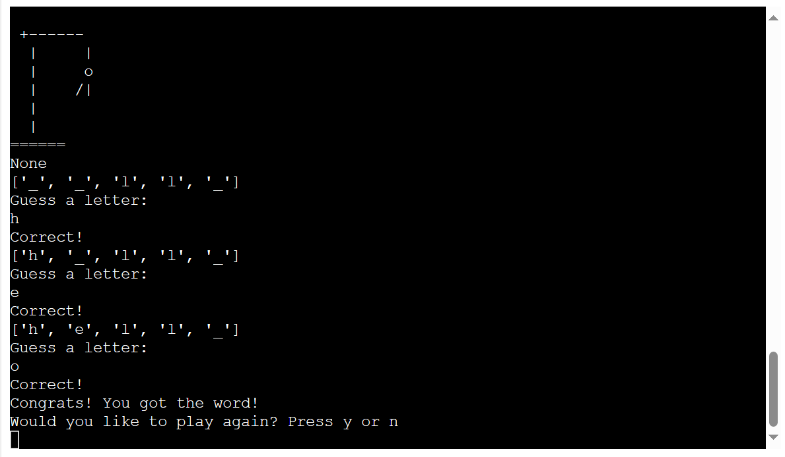

# Hangman

The purpose of this game is to try and guess the word. The player will have six chanses to guess correctly, if they make a wrong guess there will be more and more body parts added to the hangman until it is complete and at that time the player has lost the game. 

The live website: [Hangman](https://guess-correct-word-7dc0d1b2b0d6.herokuapp.com/)

## User stories

As a visiting user I want to play a word guessing game

As a visiting user I want to know how many chanses I have left by looking at the hangman 'art'

As a visiting user I want know the word at the end of the game

As a visiting user I want to have different words each time I play

As a visiting user I want to be able to restart the game

## Features

Start

Rules

Exit

Start game

Guess a letter

The display of the letters used

The word showing at the end

If you lost the game and want to restart

If you won the game and want to restart

## Future features

In the future I would like to add different levels of diffculty so it can be more fitted for everyone. 

## Technology

The repository was made on github and the workspace was created in codeanywhere.

The whole page is buildt using python with exceptions of some HTML and JavaScript that was already in the template.

The project was deployed on heroku via github

## Testing

   ### Code validation

   The code was validated on CI Python Linter and no errors where found, only a few space errors which where easily fixed
    
   

   ### Bugs

   I had some difficulty getting the letters in place when the person guessed correctly. I looked at my classmates code for help and saw that he had used this "display = ["_" for _ in range(word_lenght)]" which solved that problem. I would however like to get rid of the qoutation marks and comma signs when it's printed in terminal but I have yet to figure that out.

   At first I made a function for when the player lost the game, however it didn't show up, only the last part of the hangman would show. Therfore I moved the losing ending to be a part of the last stage of the hangman.

## User Experience

## Deployment

The game was created in codeanywhere, stored in github and deployed using heroku.

### Fork a project in Github

 * Log into your account or create a new one
 * Find the project you want to fork
 * Click the fork button in the top right corner and your done

The game was deployed on heroku, the steps where as followed:

 * Sign up for the heroku account
 * Activate you student pack
 * Create new app and choose a uniqe name
 * Press the settings tab
    * Enter your config vars
    * Add  build packs python and nodejs
* Go to the deploy tab
    * Connect to github
    * Choose the right file
    * choose automated or manual deployment
* Now you can view your project

## Credits

[Kylie Ying](https://www.youtube.com/watch?v=cJJTnI22IF8) Helping me understand in general

[Shaun Halverson](https://www.youtube.com/watch?v=pFvSb7cb_Us)

[Abdul Seyd](https://github.com/AbdulSyed05) Fellow classmate on slack, credits for the idea

Love sandwiches 

[Stackoverflow](https://stackoverflow.com/questions/2084508/clear-terminal-in-python)