# Hangman

The purpose of this game is to try and guess the word. The player will have six chanses to guess correctly, if they make a wrong guess there will be more and more body parts added to the hangman until it is complete and at that time the player has lost the game.

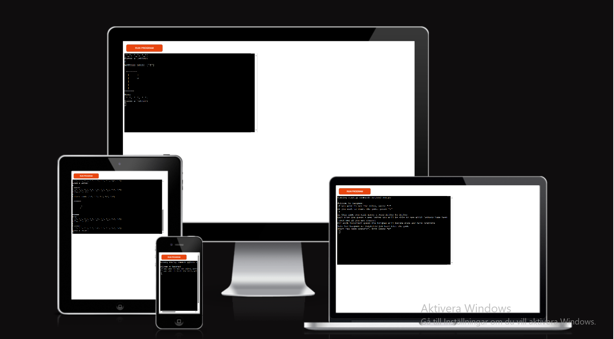

The live website: [Hangman](https://guess-correct-word-7dc0d1b2b0d6.herokuapp.com/)

## Table of contents

- [Hangman](#hangman)

- [User Stories](#user-stories)

- [Features](#features)

- [Future Features](#future-features)

- [FlowChart](#flowchart)

- [Technology](#technology)

- [Testing](#testing)

    - [Manual testing](#manual-testing)

    - [Code validation](#code-validation)

    - [Bugs](#bugs)

- [User experince](#user-experience)

- [Deployment](#deployment)

    - [Forking](#fork-a-project-in-github)

    - [Deploy on heroku](#Deploy-on-heroku)
    
- [Credits](#credits)

## User stories

As a visiting user I want to play a word guessing game

As a visiting user I want to know how many chanses I have left by looking at the hangman 'art'

As a visiting user I want know the word at the end of the game

As a visiting user I want to have different words each time I play

As a visiting user I want to be able to restart the game

## Features

Start page

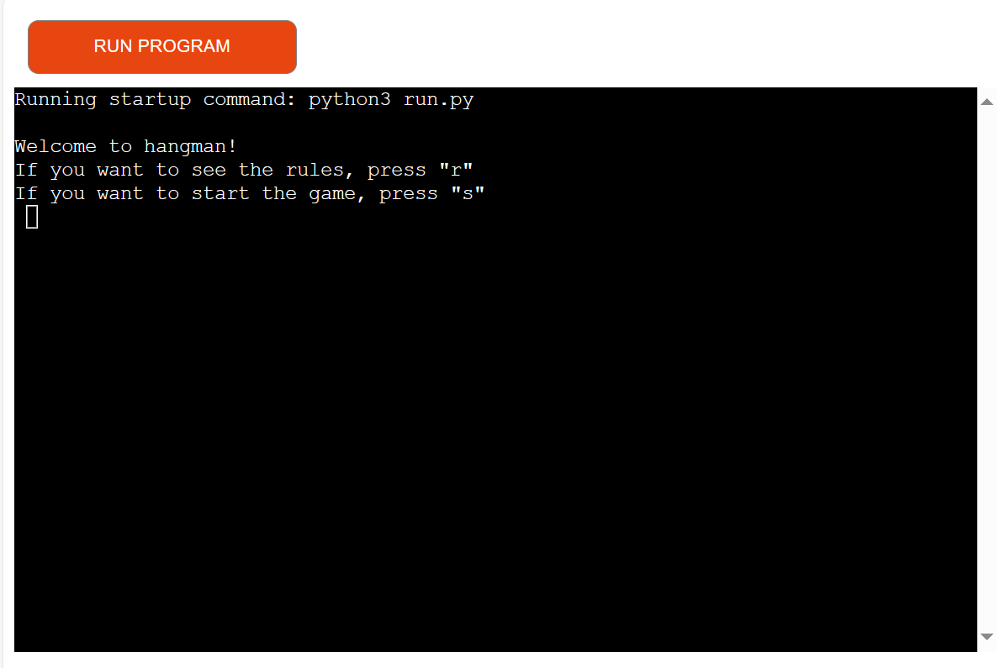

The rules

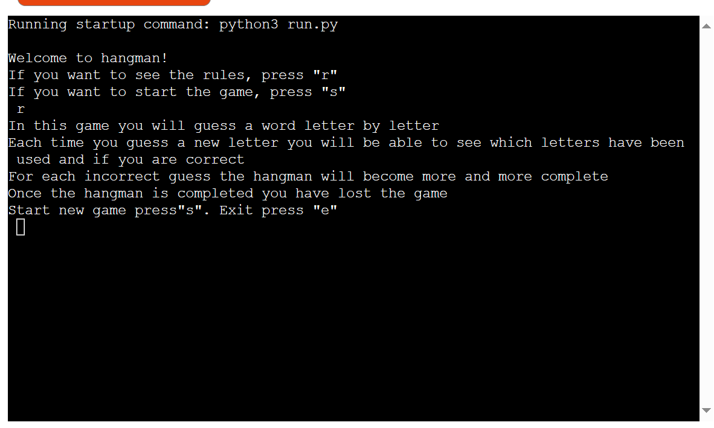

The player can exit if they want

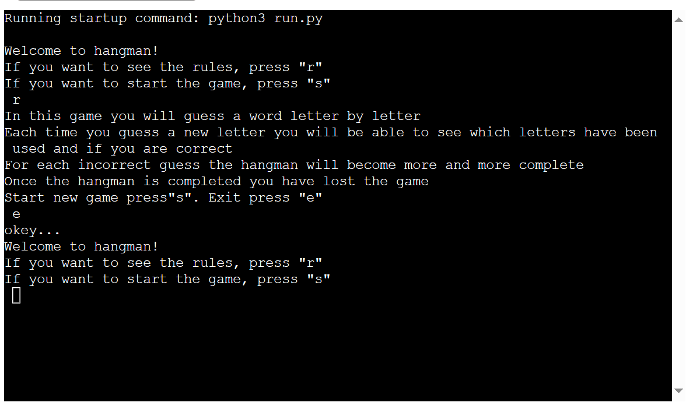

Starting the actual game

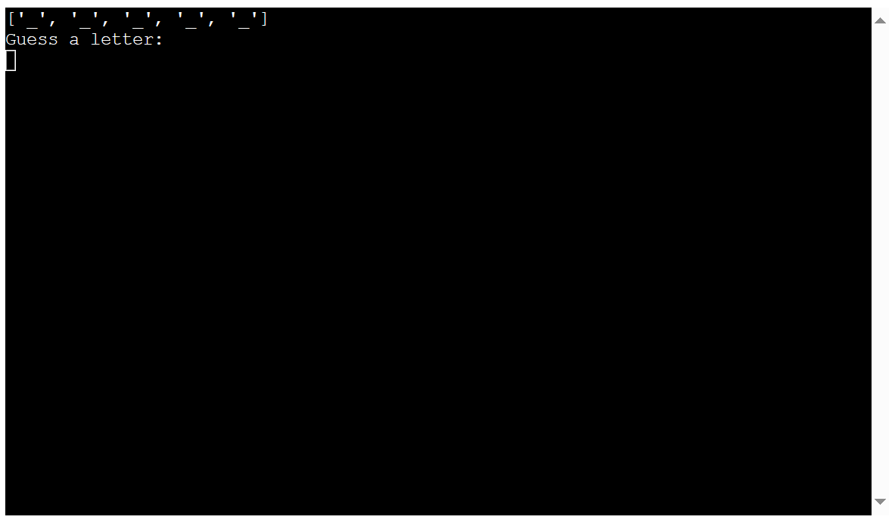

Guessing the wrong letter shows the hangman

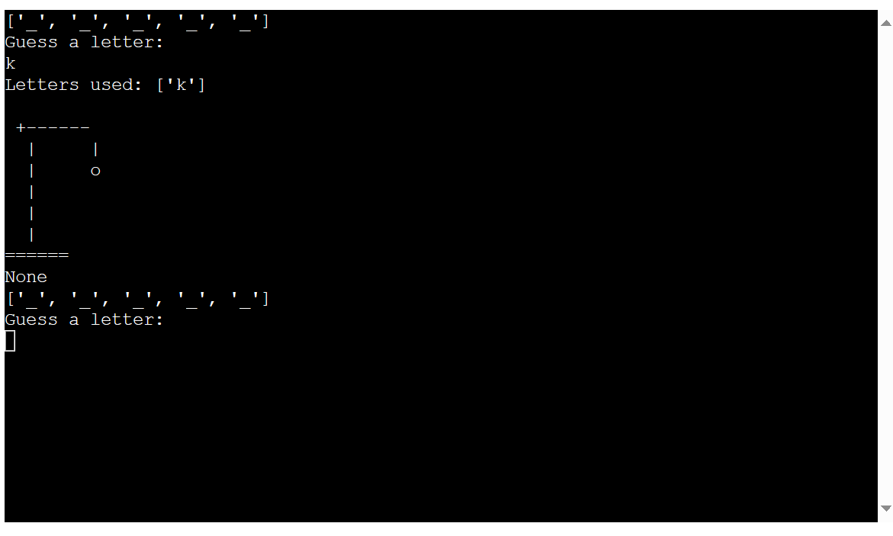

The display of the letters used

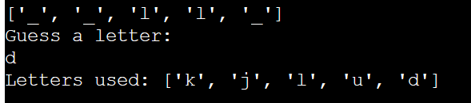

The word showing at the end when you lose the game and then when winning the game

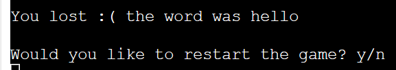

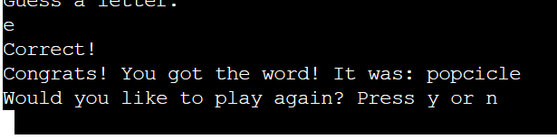

## Future features

In the future I would like to add different levels of diffculty so it can be more fitted for everyone. I would also like to add more words in general, I thought about using a dictionary as [Kylie Ying](https://www.youtube.com/watch?v=cJJTnI22IF8) did. However I thought the words were way to difficult and barely understood what most of them mean, which makes it less fun in my opinion. 

## Flowchart

The flowchart has been made in [Lucidchart](https://www.lucidchart.com/pages/sv/landing?utm_source=bing&utm_medium=cpc&utm_campaign=_chart_sv_allcountries_mixed_search_brand_exact_&km_CPC_CampaignId=369459367&km_CPC_AdGroupID=1234751733984489&km_CPC_Keyword=lucidchart&km_CPC_MatchType=e&km_CPC_ExtensionID={extensionid}&km_CPC_Network=o&km_CPC_AdPosition=&km_CPC_Creative=&km_CPC_TargetID=kwd-77172125927078:loc-174&km_CPC_Country=153578&km_CPC_Device=c&km_CPC_placement=&km_CPC_target=&mkt_query=lucidchart&msclkid=fe6f3579a30b1b9d6b5350edad8f1942)

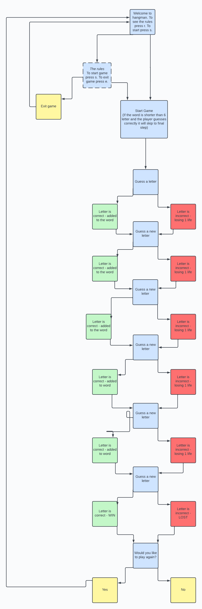

## Technology

### Language

The language used to make this game is python.

### Tools and Imports

* [Lucidchart](https://www.lucidchart.com/pages/sv/landing?utm_source=bing&utm_medium=cpc&utm_campaign=_chart_sv_allcountries_mixed_search_brand_exact_&km_CPC_CampaignId=369459367&km_CPC_AdGroupID=1234751733984489&km_CPC_Keyword=lucidchart&km_CPC_MatchType=e&km_CPC_ExtensionID={extensionid}&km_CPC_Network=o&km_CPC_AdPosition=&km_CPC_Creative=&km_CPC_TargetID=kwd-77172125927078:loc-174&km_CPC_Country=153578&km_CPC_Device=c&km_CPC_placement=&km_CPC_target=&mkt_query=lucidchart&msclkid=fe6f3579a30b1b9d6b5350edad8f1942)
    * Making the flowchart
* [Github](https://github.com/ElinGrahn/pp3)
    * Saving the files in a repository
* [Codeanywhere](https://app.codeanywhere.com/)
    * Writing the code
* [Heroku](https://dashboard.heroku.com/apps)
    * Deploying the app
* [CI Python Linter](https://pep8ci.herokuapp.com/)
    * Testing the code
* random
    * Randomizing the words in the game
* os
    * To clear the terminal

## Testing

   ### Manual testing

   The game has been tested by running it in the terminal, trying out each feature to see that it works. For larger chunks of the code it was deployed and tested in the heroku terminal.

   ### Code validation

   The code was validated on CI Python Linter and no errors where found, only a few space errors which where easily fixed
    
   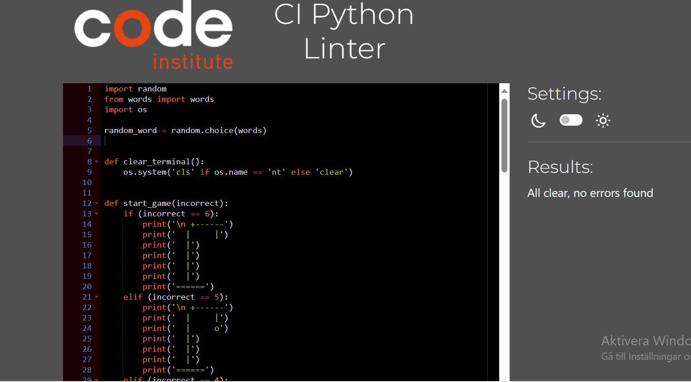

   ### Bugs

   I had some difficulty getting the letters in place when the person guessed correctly. I looked at my classmates code for help and saw that he had used this "display = ["_" for _ in range(word_lenght)]" which solved that problem. I would however like to get rid of the qoutation marks and comma signs when it's printed in terminal but I have yet to figure that out.
   
   When the hangman shows in the terminal, as well as some of the statements such as "okey bye", there is a None showing up. From what I have understood from stackoverflow it is because nothing is being returned, therfore none, however even though I have tried putting a return statement it is still there. 

## User Experience

The user will start by pressing "r" to see the rules of the game.

The user then gets the choice to either exit the game by pressing "e" or to start a new game by pressing "s". When the user starts a new game the terminal will clear and the word will show up in underscore lines and the user will be able to guess a letter.

The user guesses the wrong letter and the hangman will show up with one more limb than before

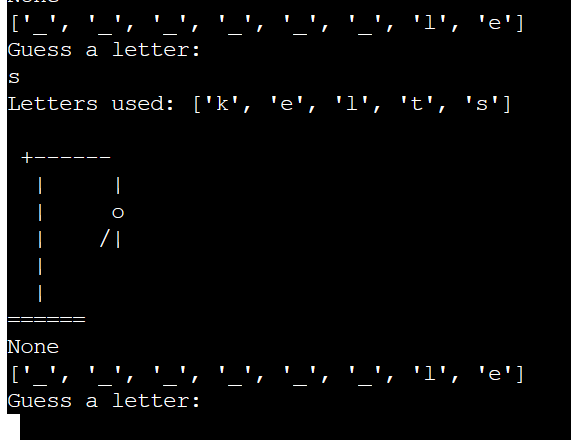

Ending 1: The user guesses the word correctly before the lives end and wins the game.

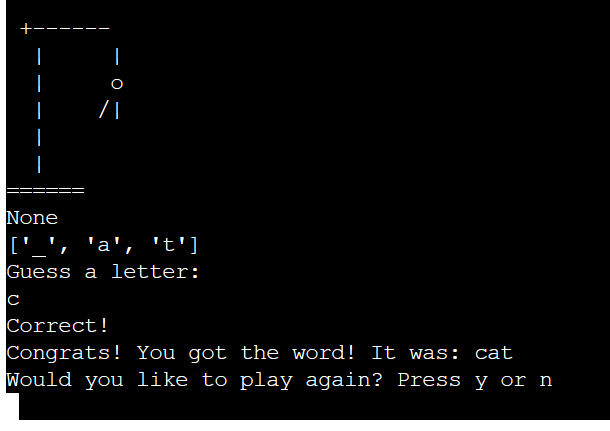

Ending 2: The user doesn't get the word and loses.

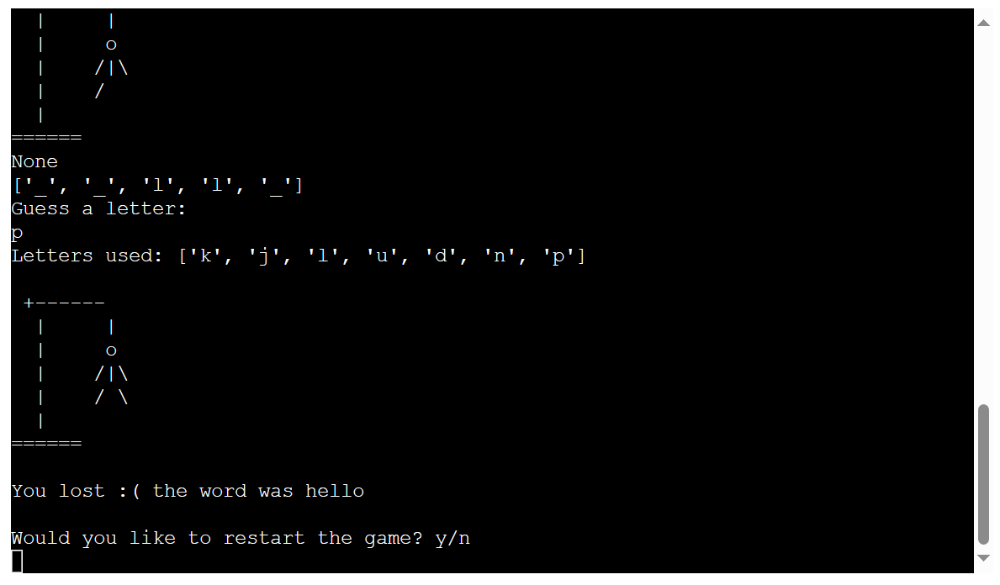

## Deployment

The game was created in codeanywhere, stored in github and deployed using heroku.

### Fork a project in Github

* Log into your account or create a new one
* Find the project you want to fork
* Click the fork button in the top right corner and your done

### Deploy on heroku

The game was deployed on heroku, the steps where as followed:

* Sign up for the heroku account
* Activate you student pack
* Create new app and choose a uniqe name
* Press the settings tab
    * Enter your config vars
    * Add  build packs python and nodejs
* Go to the deploy tab
    * Connect to github
    * Choose the right file
    * choose automated or manual deployment
* Now you can view your project

## Credits

[Kylie Ying](https://www.youtube.com/watch?v=cJJTnI22IF8) Helping me understand in general

[Shaun Halverson](https://www.youtube.com/watch?v=pFvSb7cb_Us)

[Abdul Seyd](https://github.com/AbdulSyed05) Fellow classmate on slack, credits for the idea

[Love sandwiches](https://learn.codeinstitute.net/courses/course-v1:CodeInstitute+LS101+2021_T1/courseware/293ee9d8ff3542d3b877137ed81b9a5b/e3b664e16366444c8d722c5d8340b340/) 

[Stackoverflow](https://stackoverflow.com/questions/2084508/clear-terminal-in-python)